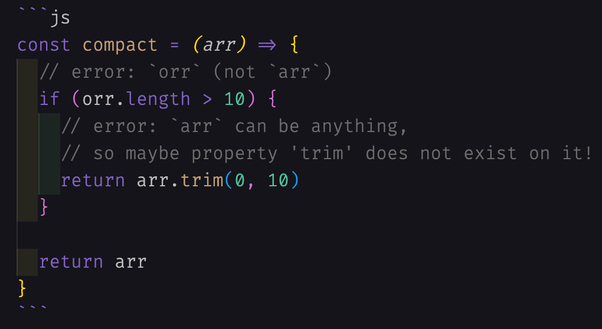
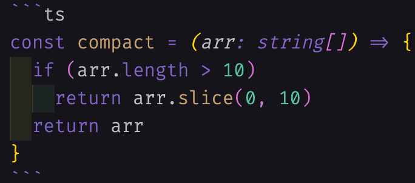

<style>
  :root {
    --color-background: #000000;
    --color-foreground: #c5c5c5;
  }

  pre code {
    color: #c5c5c5;
    background-color: black;
  }

</style>

## Content

- Introduce 🌱 TypeScript
- Basic 🧱 examples
- Practical 🏃‍♀️ exercise

---

## Part 1 - Introduce 🌱 TypeScript


Photo by [Jack Anstey](https://unsplash.com/@jack_anstey?utm_source=unsplash&utm_medium=referral&utm_content=creditCopyText) on Unsplash.

---

## Tại sao người ta lại yêu thích 💙 TypeScript

Theo khảo sát của [stack-overflow năm 2021](https://insights.stackoverflow.com/survey/2021#overview) và [năm 2020](https://insights.stackoverflow.com/survey/2020#technology-most-loved-dreaded-and-wanted-languages) thì TypeScript đều nằm trong top 3 ngôn ngữ được các developer yêu thích nhất.
Vì sao lại vậy?


---

## Chiến thuật _code ít bug_ của TypeScript ở đây là gì?

---

## Định nghĩa

> TypeScript is JavaScript with syntax for types.
> TypeScript is a strongly typed programming language

Đây là 2 điều viết ngắn gọn ở  [trang chủ  TypeScript](https://www.typescriptlang.org/).

---

## Vấn đề của JavaScript

Ta nhắc lại nhược điểm cũng là ưu điểm của JavaScript, rằng JavaScript là 1 trong số những ngôn ngữ [dynamically typed language](https://stackoverflow.com/questions/1517582/what-is-the-difference-between-statically-typed-and-dynamically-typed-languages).

---

## Ví dụ với JavaScript

Đoạn code sau sẽ không có lỗi gì, nhưng sẽ _toang_ khi chạy:



---

## Ví dụ với TypeScript

Đoạn code sau sẽ không có lỗi gì, nhưng sẽ _toang_ khi chạy:



---

## JavaScript vs TypeScript

| JavaScript | TypeScript |
|------------|------------|
| **code nhanh hơn 🐇**, vì code không cần quan tâm tới type | **code chậm hơn 🐢**, cần quan tâm tới type khi code |
| **dễ học 🐇**, code không cần quan tâm tới type | **học khó hơn 🐢**, cần học cách sử dụng type |
| **khó bảo trì 🤕**, khi hệ thống phức tạp, nhiều thứ không được định nghĩa type | **bảo trì dễ hơn 😎**, mọi thứ được định nghĩa type, dễ hiểu hơn, đặc biệt là định nghĩa params, response API, function... |

---

## Part 2 - Basic 🧱 examples


Photo by [Elliot Andrews](https://unsplash.com/@elliot_ra8?utm_source=unsplash&utm_medium=referral&utm_content=creditCopyText) on Unsplash.

---

## Ví dụ - add function

```ts
const add = (num1: number, num2: number): number => {
  return num1 + num2;
};

console.log("🚀 ~ file: add.ts ~ line 5 ~ add(2, 3)", add(2, 3));

```

---

## Run TypeScript file globally 🌠 with ts-node

```sh
node -v
# expected version is currently stable version

npm install -g typescript ts-node tslib @types/node

# verify
ts-node -v
```

---

## Prepare a simple sample

```sh
touch test.ts
```

Write a simple sample:

```ts
const teamName: string = '🦆🦆🦆';

console.log('🌊', teamName);
```

---

## Run ts file everywhere

```ts
ts-node test.ts
```

Expected output is "🌊 🦆🦆🦆".

---

## Ngoài ra có thể chạy bằng **deno** trên local 🦕

Cách cài đặt `deno` cụ thể có tại [đây](https://deno.land/).

MacOS:

```sh
brew install deno
```

Linux (ví dụ như Ubuntu):

```sh
sudo snap install deno
```

---

## Chạy bằng deno command

```sh
deno run ./test.ts
```

---


## Cách dùng từ khóa 📖 `readonly` trong class, type, interface

Trong 1 `class`, `type` hoặc `interface`, nếu 1 thuộc tính không bao giờ thay đổi thì ta có thể sử dụng `readonly`.

Nếu được gán lại bằng 1 giá trị khác thì sẽ báo lỗi `không thể gán giá trị mới cho thuộc tính này`.

>error TS2540: Cannot assign to XXX because it is a constant or a read-only property.

---

## Ví dụ trong 1 component có thuộc tính:

```ts
  public readonly columnTitles = columnTitles;
  public readonly nameMaxLength = nameMaxLength;
```

---

Ví dụ về khởi tạo giá trị trong `constructor` của `class`:

```ts
class Employee {
    readonly code: number;
    name: string;

    constructor(code: number, name: string)     {
        this.code = code;
        this.name = name;
    }
}

let emp = new Employee(10, "John");
emp.code = 20; // Compiler Error
emp.name = 'Bill';
```

---

Ví dụ về thuộc tính `readonly` của `interface`:

```ts
interface IEmployee {
    readonly code: number;
    name: string;
}

let empObj: IEmployee = {
    code: 1,
    name: 'Steve';
}

empObj.code = 100; // Compiler Error: Cannot change readonly 'code'
```

---

Ví dụ về thuộc tính `readonly` của `type`:

```ts
// or `interface IEmployee`
type Employee = {
    empCode: number;
    empName: string;
}

let emp1: Readonly<Employee> = {
    empCode: 1,
    empName: 'Steve'
}

emp1.empCode = 100; // Compiler Error: Cannot change readonly 'empCode'
emp1.empName = 'Bill'; // Compiler Error: Cannot change readonly 'empName'

let emp2: Employee = {
    empCode: 1,
    empName: 'Steve'
}

emp2.empCode = 100; // OK
emp2.empName = 'Bill'; // OK
```

---

Việc dùng `readonly` chỉ nhằm mục đích tránh những nhầm lẫn về logic, như việc đáng ra nó là biến không được thay đổi nhưng lại bị gán lại chẳng hạn.


---

## Cảm ơn vì đã lắng nghe 🌱


Photo by [Jack Anstey](https://unsplash.com/@jack_anstey?utm_source=unsplash&utm_medium=referral&utm_content=creditCopyText) on Unsplash.
